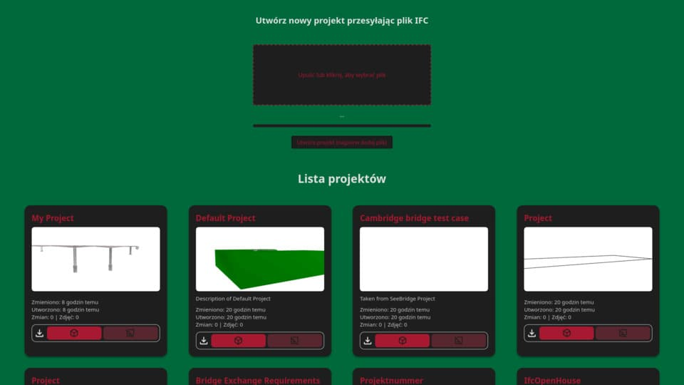
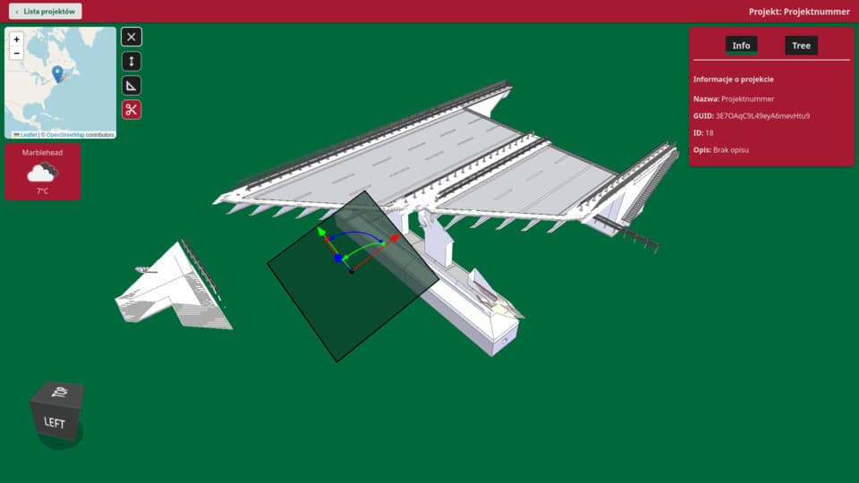
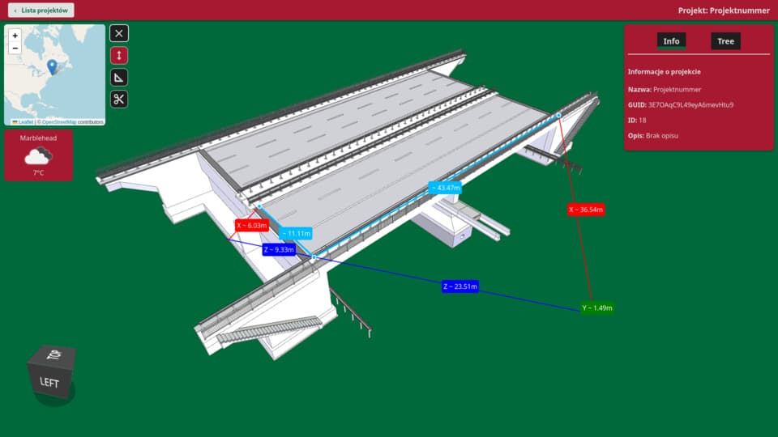

# BIM Scope

Wkleić wstęp

## Features

- Import IFC files
- Add survey information to model
- Add images of elements
- Measure elements lengths
- Measure angle between elements
- Cut model with section planes to see inside
- Show model location
- Show weather info of project location
- Export changed model to new IFC file
- Export images from model with specific name `project_guid`\_`element_guid`\_`timestamp`\.`photot_extension`

## Used stack

- Backend: Python, Flask, uv
- Frontend: React, xeokit-sdk

## External services

> [!Note]
> [openweathermap](https://openweathermap.org/) - api key required to show location weather info, add your own key in
`/app/api/database/get_project_weather.py`

## Prerequisites

- uv
- nodejs

## Usage

### clone `git clone` or download .zip

### Start backend api server

- go to /app/api
- install pyproject
- `uv sync`
- `uv run python -m flask --app main run`

### Start

- go to /app/xeokit
- `npm install`
- `npm run dev`
- enjoy

## Known issues

On some macOS devices generating thumbnails may fail, so no thumbanil sorry :(
